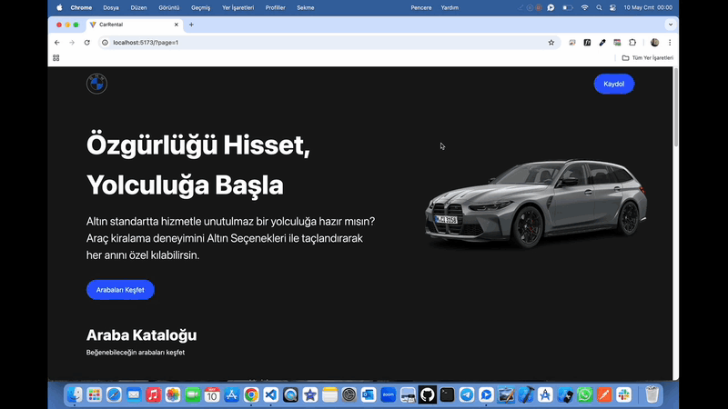

# Car-Rental 🚗🚘

<li>Bu proje React,Vite,TypeScript teknolojileri kullanılarak hazırlanmış Araç Kiralama sitesidir. </li>
<li>Marka,model,yıl seçimleri ile filtreleme yapılarak kolay erişim sağlamaktadır.</li>
<li>Tercih edilen araca ait özellikler modal yapısı ile listelenmektedir.</li>
<li>Kullanıcı dostu responsive tasarımı vardır.</li>

# Kullanılan Teknolojiler 🎨

<li>⭐ TypeScript</li>
<li>⭐ React</li>
<li>⭐ Vite</li>
<li>⭐ Json-Server</li>
<li>⭐ React-Router-Dom</li>
<li>⭐ React-Paginate</li>
<li>⭐ React-Select</li>
<li>⭐ Tailwindcss</li>
<li>⭐ Apı</li>
<li>⭐ Motion</li>

# Ekran Görüntüsü 🎥
    

# İletişim 📩
yunusemreoral@hotmail.com.tr
